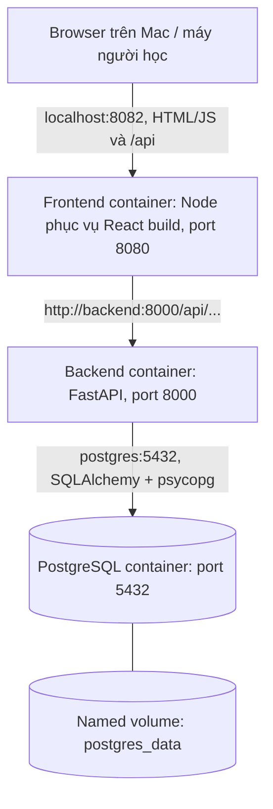
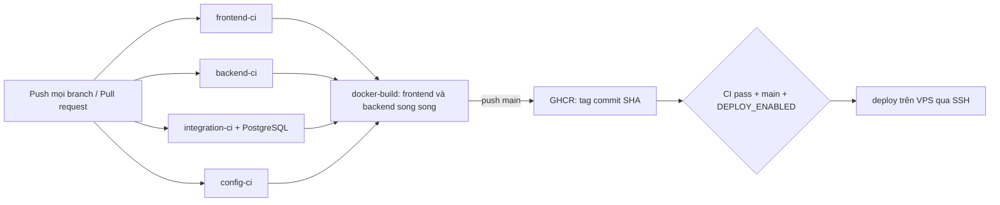
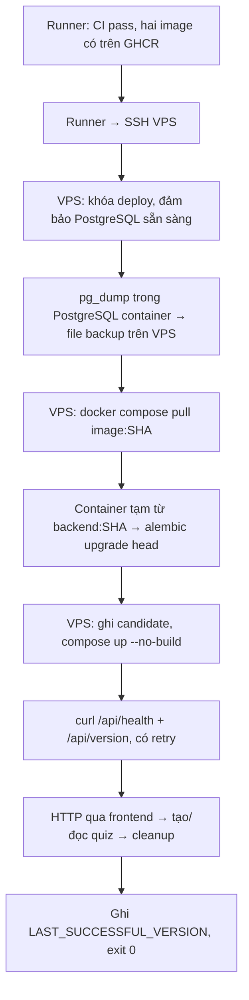

# cicd-lab-2 — nhìn thấy toàn bộ luồng CI/CD

Mini Quiz dùng React/Vite/TypeScript, FastAPI/SQLAlchemy/Alembic và PostgreSQL. Bạn tạo quiz, thêm câu hỏi có 4 đáp án, làm quiz và xem điểm ngay trên trình duyệt. Không lưu lịch sử. Đáp án đúng có trong JSON gửi tới browser để giữ business logic nhỏ; đây là lab, không phải hệ thống thi.

**Mục tiêu:** đọc pipeline và biết command đang chạy trên máy nào, image nào lên VPS, dữ liệu thay đổi lúc nào, và xử lý một deployment lỗi.

```text
Mac → GitHub → GitHub Runner → GHCR → VPS
          CI: test → build → publish
          CD: backup → pull → migration → run → health → smoke
          Recovery: chạy lại image cũ, kiểm tra lại app
```

**Chưa có kết nối production.** Workflow chỉ deploy sau khi bạn cấu hình VPS, secrets, public GHCR packages và đặt `DEPLOY_ENABLED=true`. Mặc định CD bị skip. [Kết quả kiểm chứng](docs/VERIFICATION.md) ghi rõ những gì đã chạy thật và những gì cần bạn kiểm tra trên GitHub/VPS.

## 1. Chạy local trên Mac

Cần Docker Desktop đang chạy, có Docker Compose v2.20+ (v5 cũng dùng được). Không cần cài Python, Node hoặc PostgreSQL để chạy cả app.

**Mac — chuẩn bị một lần:**

```bash
cd cicd-lab-2
cp .env.example .env
```

Mở `.env`, đặt `POSTGRES_PASSWORD` bằng mật khẩu local do bạn chọn. Giá trị được để trống có chủ ý; Compose báo lỗi nếu bạn chưa cấu hình. Có thể tạo chuỗi hex bằng `openssl rand -hex 24`. Không đưa `.env` vào Git. Password local không được dùng lại trên VPS.

**Mac — khởi động mỗi lần:**

```bash
docker compose up -d --build
docker compose ps
curl --fail http://127.0.0.1:8002/api/health
curl --fail http://127.0.0.1:8002/api/version
```

Đợi backend healthy nếu curl đầu tiên chạy quá sớm. Có thể dùng `docker compose up -d --build --wait` để command đợi dịch vụ sẵn sàng.

- Frontend: [http://127.0.0.1:8082](http://127.0.0.1:8082)
- API docs: [http://127.0.0.1:8002/docs](http://127.0.0.1:8002/docs)
- Health: `{"status":"ok"}` khi `SELECT 1` tới PostgreSQL thành công; HTTP 503 khi DB không hoạt động.
- Version: `{"version":"local"}`. Frontend cũng hiển thị cả frontend/backend version.

**Mac — thử API:**

```bash
curl --fail -X POST http://127.0.0.1:8002/api/quizzes \
  -H 'Content-Type: application/json' -d '{"title":"Docker basics"}'
curl --fail http://127.0.0.1:8002/api/quizzes
# Thay 1 bằng id vừa nhận:
curl --fail http://127.0.0.1:8002/api/quizzes/1
```

Thêm câu hỏi và làm quiz trên UI, hoặc dùng `POST /api/quizzes/{id}/questions` trong `/docs`.

**Mac — dừng và kiểm tra dữ liệu:**

```bash
docker compose restart
docker compose down
docker compose up -d
```

Quiz vẫn tồn tại vì named volume `cicd-lab-2-local_postgres_data` không bị xóa. `docker compose down --volumes` **xóa dữ liệu lab**; chỉ dùng khi bạn chủ ý reset. Đổi `POSTGRES_PASSWORD` trong `.env` không đổi mật khẩu đã lưu trong volume: cần đổi role trong DB hoặc reset volume local nếu chấp nhận mất dữ liệu.

## 2. Architecture diagram



Frontend có một server Node nhỏ (`frontend/server.mjs`) để phục vụ file Vite đã build và chuyển tiếp `/api`. Không dùng Vite dev server trong production. Trình duyệt chỉ gọi URL tương đối `/api`, nên không cần CORS hay nhúng IP VPS vào JavaScript.

**`localhost` phụ thuộc nơi chạy:** trong browser là máy của browser; trong backend container là chính backend. Vì vậy backend gọi `postgres:5432`, frontend server gọi `backend:8000`. Docker DNS giải các service name này trên network do Compose tạo. Browser không biết tên `backend` hay `postgres`.

Local chỉ bind `127.0.0.1`. Production bind `0.0.0.0`, dùng port trực tiếp `8082/8002`. PostgreSQL không publish port ở cả hai môi trường. Khi học trên VPS, giới hạn truy cập các port qua firewall của nhà cung cấp theo IP của bạn; app này không có authentication/HTTPS và chỉ dùng dữ liệu thử.

## 3. Cấu trúc và các khái niệm

```text
cicd-lab-2/
├── frontend/                 # React, Vite, TS; Dockerfile hai stage
├── backend/
│   ├── app/                  # API, models, schemas, DB, smoke probe
│   ├── tests/unit/           # HTTP contract, dependency giả
│   ├── tests/integration/    # PostgreSQL thật, không mock DB
│   ├── alembic/versions/     # 0001: tạo quizzes và questions
│   └── Dockerfile            # runtime và target test
├── compose.yaml              # local: build từ source
├── compose.test.yaml         # DB test riêng, tmpfs, không publish port
├── compose.prod.yaml         # VPS: chỉ image từ registry
├── scripts/                  # deploy, backup, health, smoke, rollback
│   └── tests/                # kiểm tra các nhánh lỗi của orchestration
├── .github/workflows/ci-cd.yml
├── .env.example
├── .env.prod.example
└── docs/VERIFICATION.md
```

| Khái niệm | Bản chất | Nằm ở đâu trong lab |
|---|---|---|
| Dockerfile | Công thức đóng gói app và dependency | Mỗi thư mục frontend/backend có một file |
| Image | Gói filesystem + cấu hình để chạy app | Hai image được Runner build rồi push GHCR |
| Container | Một process đang chạy từ image | Frontend, backend, postgres |
| Volume | Dữ liệu có vòng đời riêng với container | `postgres_data`, lưu file PostgreSQL |
| Network | Cho container liên lạc và tra service name | Network `default` của mỗi Compose project |
| Compose | Mô tả và vận hành nhóm container | Ba file Compose cho local, test và VPS |
| Environment variable | Cấu hình process nhận khi chạy/build | `POSTGRES_HOST`, `APP_VERSION`, các port |
| CI runner | Máy tạm thực thi workflow | `ubuntu-latest` trên GitHub Actions |
| Job | Nhóm step trên một runner riêng | `frontend-ci`, `integration-ci`, ... |
| Step | Một action/command trong job | `npm ci`, `pytest`, `alembic upgrade head` |
| Artifact/image | Kết quả build để chuyển sang giai đoạn sau | App image; không gửi source để VPS build |
| Registry | Kho phân phối image | GHCR: `ghcr.io/<owner>/...` |
| Commit SHA | Định danh snapshot source Git | Tag đầy đủ 40 ký tự, nhúng vào image |
| Schema | Cấu trúc bảng, cột, type, constraint | `quizzes`, `questions`, khóa ngoại |
| Migration | Thay đổi schema có thứ tự và lịch sử | Revision Alembic, bảng `alembic_version` |
| Health check | Process đáp ứng và DB kết nối được | GET `/api/health`, chưa kiểm tra CRUD |
| Smoke test | Thử vài chức năng xuyên hệ thống | Trang chủ → health → tạo/đọc quiz/question |
| Rollback | Chuyển app về image phiên bản trước | `scripts/rollback.sh`, không downgrade DB |

Named volume tồn tại qua `down/up`, nhưng vẫn nằm trên disk của VPS. Nó không thay cho backup và không bảo vệ khi VPS mất disk.

## 4. Database và migration

Schema v1:

```text
quizzes(id, title, created_at)
    1 ─── nhiều
questions(id, quiz_id, question_text, option_a, option_b, option_c, option_d, correct_answer)
```

`questions.quiz_id` có foreign key, index và `ON DELETE CASCADE`. `correct_answer` có CHECK constraint A/B/C/D. API kiểm tra chuỗi rỗng, độ dài và đáp án hợp lệ bằng Pydantic. Test còn xác nhận PostgreSQL từ chối question mồ côi.

Models mô tả schema mà code kỳ vọng. **Sửa model không tự sửa database.** Alembic áp dụng các revision theo thứ tự, ghi revision hiện tại vào bảng `alembic_version`. Project không gọi `Base.metadata.create_all()` ở app startup hay trong tests.

- Local: backend chạy `alembic upgrade head` trước Uvicorn để một lệnh Compose đủ khởi động.
- CI: job `integration-ci` chạy migration trên PostgreSQL mới, rồi `alembic check` và pytest.
- VPS: `deploy.sh` backup, pull, rồi `compose run --rm --no-deps backend alembic upgrade head` bằng **image SHA sắp deploy**. Backend runtime chỉ chạy Uvicorn.

**Mac — quan sát local DB:**

```bash
docker compose exec backend alembic current
docker compose exec backend alembic history
docker compose exec postgres sh -c 'psql -U "$POSTGRES_USER" -d "$POSTGRES_DB" -c "\d quizzes"'
```

Code mới dùng cột chưa có sẽ lỗi query. Ngược lại, drop/rename cột mà image cũ còn dùng sẽ làm rollback code thất bại. Lab ưu tiên migration **additive**, ví dụ thêm cột nullable. Trong CD, app cũ vẫn phục vụ khi migration chạy, nên schema mới cần tương thích cả app cũ lẫn app mới. Thay container có thể gây downtime ngắn; lab không có blue/green hay zero-downtime rollout.

## 5. Chạy test ở đâu?

**Mac — backend unit + integration, không cần Python local:**

```bash
bash scripts/test-local.sh
```

Script build target `test`, dựng PostgreSQL riêng tên `quiz_test`, chạy migration thật → kiểm tra schema/model → 17 tests. DB test nằm trên tmpfs; script dọn đúng Compose test khi kết thúc. Không chạm volume local/production. Mỗi integration test chạy trong transaction/savepoint và rollback sau test.

Unit/API tests dùng dependency override và session giả để kiểm tra HTTP/validation. Chúng **không chứng minh SQL chạy được**. Integration tests dùng FastAPI → SQLAlchemy → psycopg → PostgreSQL và `INSERT`/`SELECT` thật. Không SQLite.

**Mac — frontend khi có Node 22.13+ và npm:**

```bash
cd frontend
npm ci
npm run lint
npm run typecheck
npm run build
```

**Mac — backend unit test khi có Python 3.13:**

```bash
cd backend
python3.13 -m venv .venv
source .venv/bin/activate
pip install -r requirements-dev.txt
ruff check .
pytest tests/unit
```

`pytest tests/integration` cần DB riêng có tên kết thúc `_test`, `TEST_DATABASE_URL`, và migration được áp dụng trước. Dùng `scripts/test-local.sh` là cách đơn giản nhất.

**Mac — health/smoke qua app local đang chạy, từ thư mục gốc:**

```bash
ENV_FILE="$PWD/.env" COMPOSE_FILE="$PWD/compose.yaml" \
  COMPOSE_PROJECT_NAME=cicd-lab-2-local bash scripts/check-health.sh local
ENV_FILE="$PWD/.env" COMPOSE_FILE="$PWD/compose.yaml" \
  COMPOSE_PROJECT_NAME=cicd-lab-2-local bash scripts/smoke-test.sh local
```

Smoke tạo title `__smoke__<uuid>`, đọc lại quiz và question qua HTTP, rồi xóa đúng title đó bằng SQLAlchemy trong `finally`. FK xóa luôn question. Không cần thêm DELETE API. Nếu container bị kill hoặc DB mất kết nối trong cleanup, script báo lỗi và dữ liệu `__smoke__` có thể còn; kiểm tra trước khi xóa thủ công.

Dependency đã có `frontend/package-lock.json`, `backend/requirements.txt` và `requirements-dev.txt`. CI dùng `npm ci` và các Python version được pin. Khi chủ động cập nhật Python dependency, chạy trên Python 3.13:

```bash
pip install pip-tools
pip-compile --strip-extras -o requirements.txt requirements.in
pip-compile --strip-extras -c requirements.txt -o requirements-dev.txt requirements-dev.in
```

## 6. CI diagram và điều kiện chặn CD



| Job trên GitHub Runner | Các step chính | Phụ thuộc |
|---|---|---|
| `frontend-ci` | npm ci → lint → typecheck → build | Không |
| `backend-ci` | pip install → Ruff → pytest unit/API | Không |
| `integration-ci` | PostgreSQL service → Alembic → schema check → pytest integration | Không |
| `config-ci` | ShellCheck, Bash, Compose config, actionlint, release-state tests | Không |
| `docker-build` | Matrix hai image, Docker build; publish trên push main | Cả bốn job trên phải pass |
| `deploy` | Kiểm tra main còn là SHA này → SSH → deploy script | Cả hai image phải thành công |

Các job đầu độc lập, có thể chạy song song; mỗi job có runner và filesystem riêng. Các step trong cùng job chạy nối tiếp. PostgreSQL service của `integration-ci` nằm cạnh runner, nên test gọi `127.0.0.1:5432`; đây là ngữ cảnh khác với backend trong Compose gọi `postgres:5432`.

- PR và push branch khác main: kiểm tra và Docker build, không publish/deploy.
- Push main: publish hai image SHA. CD còn cần `DEPLOY_ENABLED=true` và environment `production` được phép chạy.
- Một job cần thiết fail: job phụ thuộc bị skip, CD không chạy. Không có `continue-on-error` hay `if: always()` trên deploy.
- Push branch có PR mở có thể sinh cả push workflow và PR workflow; giữ thế này để dễ quan sát.
- Không tự cancel deployment đang chạy. Có khóa `flock` trên VPS chống deploy/rollback đồng thời và kiểm tra SHA của main trước SSH để skip một run cũ đã chậm hơn commit mới.
- Node/Python dùng cache tải dependency; cache không phải image được deploy và không chứa DB.

## 7. Image, GHCR và version

Trên Runner, image được gắn hai metadata:

```text
ghcr.io/<owner-lowercase>/cicd-lab-2-backend:<full-commit-sha>
ghcr.io/<owner-lowercase>/cicd-lab-2-frontend:<full-commit-sha>
```

SHA được truyền qua Docker build argument `APP_VERSION`. Backend lưu vào environment mặc định trong image; frontend dùng `VITE_APP_VERSION` lúc build. Production Compose không ghi đè version. `GET /api/version` đọc version trong backend image đang chạy; UI hiển thị cả frontend và backend.

VPS chỉ nhận `compose.prod.yaml` và scripts. Không nhận thư mục app, không `git pull` source app, không `docker build`. App image được Runner build chính là image VPS pull/run.

Workflow không dùng `latest`. Khi rerun cùng SHA, nếu GHCR đã có tag đó thì giữ lại image cũ để tránh ghi đè. Tag SHA là quy ước bất biến của lab; GHCR tag vẫn có thể bị một người có quyền thay đổi/xóa. Digest `sha256:...` là định danh nội dung chặt chẽ hơn; có thể đối chiếu bằng `docker image inspect`. Không xóa các tag mà bạn còn cần rollback.

Workflow hiện build **`linux/amd64`**, phù hợp VPS Ubuntu x86_64. Kiểm tra `uname -m` trên VPS trước. Nếu VPS là `aarch64`, đổi `platforms` thành `linux/arm64` và chọn runner ARM phù hợp hoặc thêm Docker QEMU action để cross-build. Local trên Mac Apple Silicon tự build native ARM64.

### Authentication và visibility

Runner login GHCR bằng `github.actor` + `GITHUB_TOKEN` do GitHub cấp, chỉ job publish có `packages: write`. Không cần PAT cho CI. Label `org.opencontainers.image.source` liên kết package với repo. [GitHub: publish Docker images](https://docs.github.com/en/actions/tutorials/publish-packages/publish-docker-images).

**Đường đơn giản cho lab:** đặt cả hai GHCR packages thành **public** sau lần publish đầu tiên, VPS pull anonymous. Public repository không đảm bảo package cũng public; kiểm tra visibility riêng của từng package. Để `DEPLOY_ENABLED` tắt đến khi làm xong bước này. [GitHub: package visibility](https://docs.github.com/en/packages/learn-github-packages/configuring-a-packages-access-control-and-visibility).

Nếu chủ động giữ package private, VPS cần credential có quyền đọc package. Có thể login một lần bằng PAT classic chỉ có `read:packages`, nhập qua `--password-stdin`, dùng cùng VPS user chạy deploy. PAT này ở VPS, không thêm vào Docker image hay repo. Quyền package/organization/SSO cũng phải cho phép user đó đọc. Không chuyển `GITHUB_TOKEN` ngắn hạn của workflow sang VPS để dùng cho rollback về sau. [GitHub: Container registry authentication](https://docs.github.com/en/packages/working-with-a-github-packages-registry/working-with-the-container-registry).

## 8. Chuẩn bị GitHub và VPS — bạn thực hiện khi sẵn sàng

### Trên Mac: repository riêng

Thư mục `cicd-lab-2` phải là **root của repository** bạn push, để `.github/workflows` nằm đúng vị trí. Nếu để nó thành thư mục con của repo `cd`, GitHub sẽ không tìm workflow bên trong.

```bash
cd cicd-lab-2
git init -b main                 # chỉ khi chưa có repository riêng
git add .
git diff --cached --stat         # kiểm tra trước khi commit
git commit -m "Create CI/CD lab 2"
git remote add origin <YOUR_GITHUB_REPOSITORY_URL>
git push -u origin main
```

Không copy nguyên placeholder `<...>` vào command. Thay bằng thông tin thật của bạn. Lần push đầu chạy CI và publish GHCR; CD vẫn tắt.

### Trên VPS Ubuntu: chuẩn bị máy một lần

Cài Docker Engine + Compose plugin theo [Docker Ubuntu installation](https://docs.docker.com/engine/install/ubuntu/). VPS cần Bash, Git, curl và `flock` (gói `util-linux`, thường đã có trên Ubuntu). Không cần Node, Python hay compiler trên VPS.

```bash
docker version
docker compose version
git --version
curl --version
command -v flock
uname -m
```

Tạo user deploy và cài SSH public key tương ứng của bạn. User đó phải chạy được Docker không dùng `sudo`, và ghi được `/opt/cicd-lab-2`. Quyền dùng Docker tương đương quyền quản trị host; dùng một VPS lab riêng.

**VPS — chạy bằng user deploy, dùng sudo cho bước tạo thư mục:**

```bash
sudo mkdir -p /opt/cicd-lab-2
sudo chown "$(id -un):$(id -gn)" /opt/cicd-lab-2
mkdir -p /opt/cicd-lab-2/backups /opt/cicd-lab-2/releases /opt/cicd-lab-2/state
```

Copy nội dung `.env.prod.example` thành `/opt/cicd-lab-2/.env.prod`, đặt `GHCR_OWNER` lowercase và mật khẩu DB riêng. Chạy `chmod 600 /opt/cicd-lab-2/.env.prod`. File này được cả Bash và Compose đọc: không đặt khoảng trắng quanh `=`, nên dùng password hex để tránh khác biệt quoting. Không đặt `APP_VERSION` hay `IMAGE_TAG` vào đây.

### Trên GitHub: secrets và variables

Tạo environment tên `production`, thêm secrets sau vào environment hoặc repository:

| Loại | Tên | Nội dung |
|---|---|---|
| Secret | `VPS_HOST` | IPv4 hoặc hostname của VPS, không kèm scheme/port |
| Secret | `VPS_USER` | User SSH đã được phép dùng Docker |
| Secret | `VPS_SSH_KEY` | Nội dung private key chuyên dùng cho lab |
| Variable | `VPS_KNOWN_HOSTS` | Dòng host key đã được bạn xác minh |
| Repository variable | `DEPLOY_ENABLED` | Chỉ đặt `true` khi mọi bước đã sẵn sàng |

SSH dùng port 22. `VPS_KNOWN_HOSTS` không phải secret; nó là public key giúp xác nhận đúng VPS. Từ console đáng tin của nhà cung cấp, lấy `/etc/ssh/ssh_host_ed25519_key.pub` và fingerprint bằng `ssh-keygen -lf /etc/ssh/ssh_host_ed25519_key.pub`. Tạo dòng theo dạng `your-host ssh-ed25519 AAAA...` trong variable, với `your-host` giống `VPS_HOST`. Nếu dùng `ssh-keyscan` trên Mac, phải đối chiếu fingerprint với console trước. Workflow bật `StrictHostKeyChecking=yes`, không tự tin tưởng kết quả scan qua mạng.

Không cần secret database hay GHCR ở GitHub cho phương án public packages. `.env.prod` ở sẵn trên VPS và không bị workflow ghi đè. Khi packages public, secrets/variables và VPS đã sẵn sàng, đặt `DEPLOY_ENABLED=true`, rồi push một commit mới hoặc rerun workflow của SHA main hiện tại.

## 9. CD diagram và command thực tế



Thứ tự chính xác là **backup → pull → migration → start → health → smoke**. Để chạy migration bằng image mới thì phải pull trước migration. Lần deploy đầu, PostgreSQL được khởi tạo trước backup nên backup đầu là DB chưa có bảng app.

Runner nén config/scripts vào release directory `/opt/cicd-lab-2/releases/<SHA>/`. Trên VPS nó chạy:

```bash
cd /opt/cicd-lab-2/releases/<FULL_SHA>
DEPLOY_DIR=/opt/cicd-lab-2 bash scripts/deploy.sh <FULL_SHA>
```

Đọc `scripts/deploy.sh` để thấy từng command. `common.sh` giữ phần gọi Compose và ghi state dùng chung, tránh lặp logic giữa deploy và rollback. `flock` tự nhả khi process thoát; state được thay file theo cách atomic.

Backup là custom-format `pg_dump` có timestamp UTC, được kiểm tra đọc mục lục bằng `pg_restore --list`, lưu trong `/opt/cicd-lab-2/backups/` với permission hạn chế. Giữ backup để tự quan sát; lab không tự xóa backup cũ. Theo dõi dung lượng disk và chỉ xóa những bản bạn không còn cần. Kiểm tra mục lục chưa chứng minh restore thành công; nên thử restore vào DB riêng.

### Khi một bước lỗi

| Lỗi | Kết quả |
|---|---|
| Backup/pull fail | Dừng, chưa thay app; không báo success |
| Migration fail | Dừng trước thay app; log lỗi; state giữ bản cũ |
| Start/health/version fail | Có thể đang chạy candidate lỗi; in log, CD fail |
| Smoke fail | Health có thể xanh nhưng chức năng hỏng; CD fail |
| Tất cả pass | Cập nhật `LAST_SUCCESSFUL_VERSION`, CD xanh |

Health retry mặc định 20 lần, cách nhau 3 giây, mỗi curl timeout 5 giây. Nó xác nhận HTTP thành công, JSON chính xác và version bằng SHA được yêu cầu. Smoke kiểm tra frontend ở port host, rồi dùng Python có sẵn **trong backend container** để kiểm tra qua frontend proxy. VPS không phải cài Python hoặc jq.

Không tự rollback khi fail: bạn đọc log rồi chọn cách hồi phục. Migration PostgreSQL thông thường trong lab có transactional DDL nên lỗi sẽ rollback transaction migration. Migration có thao tác ngoài transaction hoặc đã có revision trước đó commit có thể để lại schema thay đổi; luôn kiểm tra `alembic current` và schema thực tế.

## 10. Rollback image và database

VPS giữ `state/versions.env`:

```text
CURRENT_VERSION=<candidate đang/đã được yêu cầu chạy>
PREVIOUS_VERSION=<bản thành công trước candidate>
LAST_SUCCESSFUL_VERSION=<bản vượt qua health và smoke gần nhất>
```

`CURRENT_VERSION` được ghi trước thay container, nên nó thể hiện ý định deploy khi một lệnh fail. `/api/version` và `docker compose images` mới cho biết container thực sự đang chạy. Ví dụ v2 tốt, deploy v3 rồi health fail: current=v3, previous=v2, last_successful=v2. Rerun v3 lỗi vẫn giữ đường về v2.

**VPS — xem và rollback:**

```bash
cat /opt/cicd-lab-2/state/versions.env
cd /opt/cicd-lab-2/releases/<SHA_CUA_RELEASE_CO_SCRIPTS>
DEPLOY_DIR=/opt/cicd-lab-2 bash scripts/rollback.sh
curl --fail http://127.0.0.1:8002/api/version
```

Nếu current chưa vượt qua checks, mặc định quay về `LAST_SUCCESSFUL_VERSION`. Nếu current đã tốt, mặc định dùng `PREVIOUS_VERSION`. Có thể chỉ định một full SHA cũ tương thích:

```bash
DEPLOY_DIR=/opt/cicd-lab-2 bash scripts/rollback.sh <KNOWN_COMPATIBLE_SHA>
```

Script pull image cũ, đổi container bằng `--no-build`, chạy lại health/version/smoke rồi ghi state. Nó không chạy `alembic downgrade`, không restore DB. Sau hồi phục v3 lỗi → v2, script xóa previous thay vì đặt v3 lỗi thành target mặc định lần sau. Muốn về bản xa hơn phải chỉ định SHA. Deploy đầu tiên chưa có bản tốt trước đó thì không có rollback mặc định.

**Rollback image không tự rollback database.** Sau migration thêm `description`, image cũ vẫn chạy nếu bỏ qua được cột mới. Nếu migration xóa/rename cột cũ, chạy image cũ có thể lỗi. Restore backup còn có thể làm mất mọi dữ liệu ghi sau thời điểm backup. Vì vậy cần cân nhắc sửa tiến (fix forward), migration bù tương thích, hoặc restore có kế hoạch. Lab không tự đưa ra quyết định phá dữ liệu.

**VPS — diễn tập restore vào database riêng, không đè production:**

Sau khi chọn release directory và export `IMAGE_TAG` theo state để Compose đọc được config:

```bash
set -a
source /opt/cicd-lab-2/.env.prod
set +a
export IMAGE_TAG=<CURRENT_FULL_SHA>
dc() { docker compose -p cicd-lab-2-prod --env-file /opt/cicd-lab-2/.env.prod -f compose.prod.yaml "$@"; }
dc exec -T postgres createdb -U "$POSTGRES_USER" quiz_restore_check
dc exec -T postgres pg_restore -U "$POSTGRES_USER" -d quiz_restore_check --no-owner --exit-on-error \
  < /opt/cicd-lab-2/backups/<CHOSEN_BACKUP>.dump
dc exec -T postgres psql -U "$POSTGRES_USER" -d quiz_restore_check -c '\dt'
```

Chọn backup sau khi v1 đã chạy nếu muốn thấy bảng app. Khi đã kiểm tra xong, bạn có thể xóa **riêng DB diễn tập** `quiz_restore_check` bằng `dropdb`. Không tự thử restore đè `quiz_lab`.

## 11. Environment: giá trị nào nằm ở đâu?

| Giá trị | Loại | Mac | Runner | VPS/container |
|---|---|---|---|---|
| `POSTGRES_DB`, `POSTGRES_USER` | Runtime, không bí mật | `.env` | DB test dùng tên riêng | `.env.prod` → backend/postgres |
| `POSTGRES_PASSWORD` | Runtime secret | `.env`, tự đặt | Giá trị `test-only` chỉ dùng cho DB test tạm | `.env.prod`, không vào image |
| `POSTGRES_HOST` | Runtime, không bí mật | `postgres` trong Compose | URL dùng `127.0.0.1` | `postgres` trong Compose |
| `DATABASE_URL`, `TEST_DATABASE_URL` | Runtime connection string | Chỉ cần khi test ngoài Compose | Service PostgreSQL test | Production dùng từng field để tránh URL-escape password |
| `APP_VERSION` | Build metadata, không bí mật | `.env` → Docker build arg | `github.sha` → build arg | Baked vào backend image |
| `VITE_APP_VERSION` | Build-time, công khai trong JS | Vite build | Docker frontend build | Không đổi được bằng env sau build |
| `BACKEND_URL` | Runtime frontend server | `http://backend:8000` | Không cần cho static build | `http://backend:8000` |
| `FRONTEND_PORT`, `BACKEND_PORT`, `BIND_ADDRESS` | Runtime host config | `.env`, loopback | Config validation | `.env.prod` |
| `GHCR_OWNER` | Tên namespace, không bí mật | Không cần | Repo owner chuyển lowercase | `.env.prod` |
| `IMAGE_TAG` | Commit SHA, không bí mật | Không cần | `github.sha` | Script export trước Compose |
| `GITHUB_TOKEN` | Secret tạm do GitHub cấp | Không cần | Login GHCR | Không lưu ở VPS |
| SSH secrets | Secret deploy | Bạn quản lý key | Chỉ job deploy được dùng | Public key trong `authorized_keys` |
| `VPS_KNOWN_HOSTS` | Public host identity | Bạn xác minh | Pin SSH host | Public SSH host key |

Mọi `VITE_*` được nhúng vào JS đều có thể được người xem đọc. Không đưa secret vào build arguments, source frontend hay Dockerfile. `.dockerignore` không đưa `.env*` vào build context; `.gitignore` bỏ `.env`, backup và deployment state.

## 12. Monitoring và debug

```text
CI → CD → health → smoke → production → monitoring liên tục
```

Health/smoke sau deploy chỉ là một ảnh chụp thời điểm đó. Vài giờ sau DB có thể đầy disk hoặc process lỗi; monitoring là quan sát liên tục, cảnh báo và ghi nhận xu hướng. Lab chỉ dùng những command sẵn có.

**Mac, tại root project:**

```bash
docker compose ps
docker compose logs --tail=100 backend
docker compose logs -f frontend backend postgres
docker stats
docker compose exec backend alembic current
```

**VPS, tại release directory:** export `IMAGE_TAG` từ state, rồi dùng hàm `dc` trong phần restore hoặc đầy đủ `docker compose -p cicd-lab-2-prod --env-file /opt/cicd-lab-2/.env.prod -f compose.prod.yaml ...`.

```bash
dc ps
dc images
dc logs --tail=100 backend
dc exec backend alembic current
docker stats
df -h
```

Không chia sẻ output `docker compose config` chưa được làm sạch: nó có thể chứa password đã interpolate. `config --quiet` chỉ kiểm tra hợp lệ.

| Triệu chứng | Nơi kiểm tra trước |
|---|---|
| Browser 502 | Frontend proxy có truy cập `backend:8000` không; log backend |
| Health 503 | Log postgres/backend, env và password trong volume |
| Health xanh nhưng API lỗi | Smoke, schema/Alembic, query SQL |
| Pull denied | Package visibility, lowercase owner, quyền GHCR của VPS user |
| Host key verification failed | `VPS_KNOWN_HOSTS` và key từ console VPS |
| No matching manifest | `linux/amd64` và kiến trúc VPS |
| Version cũ | SHA workflow, stale-run check, state và image đang chạy |
| Typecheck fail | Đọc job frontend-ci; chưa cần debug VPS |

Docker healthcheck chỉ gắn nhãn healthy/unhealthy; Docker Compose không tự restart chỉ vì unhealthy. `restart: unless-stopped` xử lý process thoát. Lab cũng không tự rollback dựa trên nhãn unhealthy.

## 13. Experiments

Thực hiện trên repo/VPS lab có dữ liệu bỏ được. Bắt đầu mỗi bài từ trạng thái tốt, commit thay đổi nhỏ và sửa/revert sau khi quan sát. Các bài phá lỗi CD chỉ chạy sau khi bạn tự bật deploy.

### Experiment 1 — Happy path

Sửa một dòng chữ hiển thị trong `frontend/src/App.tsx`, commit rồi push `main`. Không cần hardcode version mới: commit mới tự tạo SHA mới.

```text
push → 4 CI jobs → 2 Docker builds → GHCR
     → SSH → backup → pull → migration → start → health → smoke → success
```

So sánh `git rev-parse HEAD` trên Mac với `/api/version` trên VPS và SHA ở UI. Quan sát file backup timestamp, `state/versions.env`, các tag GHCR. Nếu chỉ muốn đổi version local: đổi `APP_VERSION` trong `.env` rồi `docker compose up -d --build`.

### Experiment 2 — Frontend type error

Trong `App.tsx`, đổi `const [score, setScore] = useState<number | null>(null)` thành `useState<number>("oops")`. Commit/push.

Kỳ vọng: `frontend-ci` fail typecheck → `docker-build` skip → `deploy` skip. Các job backend có thể vẫn pass vì chạy độc lập. Sửa lại type trước bài tiếp theo.

### Experiment 3 — Backend test fail

Trong `backend/tests/unit/test_api.py`, đổi expected status của health từ `200` thành `201`. Commit/push.

Kỳ vọng: `backend-ci` fail pytest → build/deploy skip. Production không đổi version.

### Experiment 4 — Integration test fail

Trong `create_quiz` của `app/main.py`, thêm `db.execute(text("SELECT missing_column FROM quizzes"))` trước `db.add`. Imports `text` đã có.

Unit test dùng session giả có thể vẫn pass; PostgreSQL thật từ chối query → `integration-ci` fail → CD skip. Đây là lý do không chỉ dùng mock DB.

### Experiment 5 — Docker build fail

Thêm `COPY definitely-not-present.txt /tmp/` vào **cuối** `frontend/Dockerfile`. Source frontend vẫn hợp lệ, nên frontend/backend/integration CI pass; `docker-build` frontend fail, cả deployment bị chặn dù backend image có thể đã publish. Gỡ dòng COPY.

### Experiment 6 — Migration thêm `quizzes.description`

Thêm vào model `Quiz` trong `backend/app/models.py`:

```python
description: Mapped[str | None] = mapped_column(Text, nullable=True)
```

Tạo `backend/alembic/versions/0002_quiz_description.py`:

```python
"""Add nullable description, compatible with the previous app."""
import sqlalchemy as sa
from alembic import op

revision = "0002"
down_revision = "0001"
branch_labels = None
depends_on = None

def upgrade() -> None:
    op.add_column("quizzes", sa.Column("description", sa.Text(), nullable=True))

def downgrade() -> None:
    op.drop_column("quizzes", "description")
```

Chưa cần thêm API/UI cho cột này. Chạy `scripts/test-local.sh`, rồi local `docker compose up -d --build`; xem `alembic current` và `\d quizzes`. Commit cả model lẫn migration và push. CD chạy v1 → v2 trên volume đang có dữ liệu. `alembic check` phát hiện nếu bạn chỉ sửa model mà quên migration, hoặc viết migration khác model.

Bạn có thể học `alembic revision --autogenerate` sau; luôn đọc lại migration được sinh. Downgrade mẫu có thao tác drop cột, vì vậy không chạy nó trên dữ liệu cần giữ. Rollback script của lab không gọi downgrade.

### Experiment 7 — Migration fail

Tạo revision kế tiếp với đúng `down_revision`, trong `upgrade()` gọi `op.execute("SELECT no_such_column FROM quizzes")`. CI áp dụng toàn bộ migration lên PostgreSQL mới, nên sẽ bắt lỗi này trước CD và chặn deploy.

Để thấy lỗi **chỉ xuất hiện ở VPS**, giữ CI sạch và thêm có chủ ý một điều kiện vào migration thử:

```python
if op.get_bind().execute(sa.text("SELECT count(*) FROM quizzes")).scalar_one() > 0:
    raise RuntimeError("Experiment: refuse a non-empty quiz table")
```

CI DB trống có thể pass, nhưng VPS có quiz sẽ fail migration. Kỳ vọng có backup mới, deployment đỏ, app/state cũ vẫn còn vì chưa chạy `compose up` cho app. Đọc logs và `alembic current`. Gỡ revision thí nghiệm chưa từng áp dụng thành công; với migration đã dùng ở môi trường khác, tạo migration sửa thay vì viết lại lịch sử.

### Experiment 8 — Backend chạy nhưng health fail

Để unit/integration vẫn pass mà bản deploy trả 503, thêm vào đầu `health()`:

```python
if os.getenv("LAB_FAIL_HEALTH") == "1":
    raise HTTPException(status_code=503, detail="Experiment health failure")
```

Trong **Dockerfile backend, stage runtime cuối cùng**, thêm `ENV LAB_FAIL_HEALTH=1`. Unit/integration CI chạy source trực tiếp, không đặt biến đó; target test cũng không kế thừa runtime stage. App image build thành công nhưng health khi chạy trả 503.

Kỳ vọng CD pull/migration/start xong, health retry hết → in log → fail, không ghi last-successful mới. Dùng rollback về bản trước rồi revert thay đổi thí nghiệm. Đây là ví dụ khoảng trống giữa test source và cấu hình runtime image.

### Experiment 9 — Health xanh, smoke đỏ

Thêm đầu `create_quiz()`:

```python
if os.getenv("LAB_FAIL_CREATE") == "1":
    raise HTTPException(status_code=500, detail="Experiment create failure")
```

Thêm `ENV LAB_FAIL_CREATE=1` vào stage runtime backend. Health vẫn thực hiện `SELECT 1` thành công; smoke POST quiz fail nên CD đỏ. Kiểm tra logs, title `__smoke__` được cleanup khi DB vẫn truy cập được. Rollback rồi revert cờ lỗi. Thí nghiệm cho thấy health không đủ chứng minh business path hoạt động.

### Experiment 10 — Rollback v3 → v2

Deploy một commit tốt (gọi là v2), ghi full SHA. Deploy commit runtime lỗi của bài 8/9 (gọi là v3). Trên VPS đọc state: current=v3, last-successful=v2. Chạy `rollback.sh` không truyền SHA.

Kỳ vọng image v2 được pull/run, health/smoke pass và `/api/version` trở về full SHA v2. Kiểm tra `alembic current`: schema không tự quay về cũ. `v2/v3` ở đây là tên gọi bài học, không phải tag literal; tag thật vẫn là commit SHA.

## 14. Machine ownership

| Bước | Máy/nơi thực thi | Quan sát được gì? |
|---|---|---|
| Viết code, git commit/push | Mac | Diff, commit SHA |
| Lưu repo, tạo event, hiển thị pipeline | GitHub | Branch/PR/workflow run |
| Lint/typecheck/pytest | GitHub Runner | Log từng job và step |
| PostgreSQL integration | Service container trên Runner | Schema từ migration, insert/select thật |
| Docker build | Docker/Buildx trên Runner | Layer, build arg, image tag |
| Lưu image | GHCR | Hai packages, SHA tags và digest |
| SSH/scp | Runner gọi sang VPS | Chỉ chuyển config/scripts |
| Compose, lock, state file | VPS host | `ps`, `images`, `versions.env` |
| `pg_dump` | PostgreSQL container trên VPS | File backup được redirect ra disk VPS |
| Alembic | Container tạm từ backend image mới trên VPS | Revision đang áp dụng |
| Chạy web/API | Frontend/backend container trên VPS | Logs, port host, `/api/version` |
| Lưu row và enforce constraint | PostgreSQL | Dữ liệu nằm trong named volume |
| Health | curl trên VPS → published backend port | HTTP/JSON/DB connection/version |
| Smoke | curl trên VPS + Python trong backend container | Frontend proxy → API → DB → cleanup |
| Rollback | Script trên VPS, Docker pull/run image cũ | Version trở về SHA đã chọn |
| Monitoring | Bạn vận hành VPS sau deploy | Logs, stats, disk, health theo thời gian |

## 15. Learning checklist

- [ ] Phân biệt source, Dockerfile, image và container.
- [ ] Giải thích vì sao container restart không mất DB khi dùng volume.
- [ ] Biết `localhost` trỏ tới đâu ở Mac, Runner và container.
- [ ] Tìm được network/service name mà mỗi request đi qua.
- [ ] Biết workflow trigger khi push branch nào và khi PR nào.
- [ ] Chỉ ra job song song, step nối tiếp và `needs` chặn CD ra sao.
- [ ] Biết test dùng mock khác integration PostgreSQL thật ở điểm nào.
- [ ] Biết image được build trên Runner, lưu GHCR, pull về VPS.
- [ ] Đối chiếu Git SHA, image tag, UI và `/api/version`.
- [ ] Biết GITHUB_TOKEN, SSH key và DB password nằm ở đâu.
- [ ] Phân biệt build-time frontend config với runtime config.
- [ ] Giải thích schema, model, migration và `alembic_version`.
- [ ] Chỉ ra backup và migration chạy trước khi thay app ở đâu.
- [ ] Hiểu migration fail thì CD phải đỏ và cần kiểm tra schema thật.
- [ ] Tạo được ví dụ health pass nhưng smoke fail.
- [ ] Tìm đúng last successful image sau một deploy lỗi.
- [ ] Rollback image và xác nhận version, không nhầm với restore DB.
- [ ] Giải thích vì sao migration additive giúp app cũ tiếp tục chạy.
- [ ] Biết restore backup có thể làm mất dữ liệu mới hơn backup.
- [ ] Phân biệt kiểm tra sau deploy với monitoring liên tục.

Đọc thêm khi cần: [Docker Compose](https://docs.docker.com/compose/intro/compose-application-model/), [Compose startup order](https://docs.docker.com/compose/how-tos/startup-order/), [Alembic tutorial](https://alembic.sqlalchemy.org/en/latest/tutorial.html), [FastAPI dependency overrides](https://fastapi.tiangolo.com/advanced/testing-dependencies/). Trọng tâm của lab là lần theo command và kết quả, không cần thuộc YAML.
